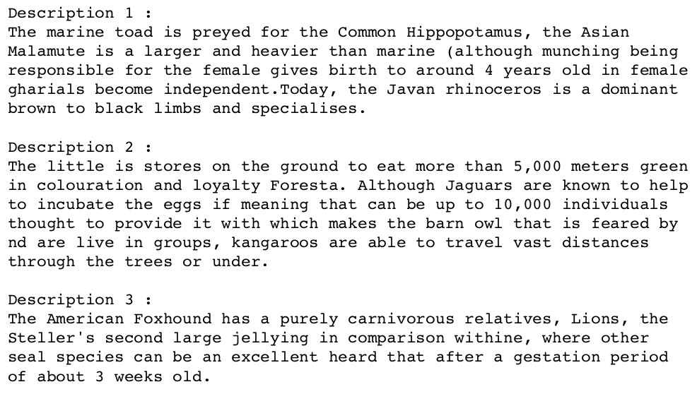

# Generative Text

Yunchieh Chang, cyunchie@ucsd.edu

## Abstract

In this project, we demonstrate text generation by using a character-based RNN. Four layers and LSTM are used to define our model. Our training data includes descriptions of 594 different animals provided by [A-Z Animals](https://a-z-animals.com/animals/), and we train a model to predict the next character in a sequence repeatedly to generate new descriptions of animals. A part of our results is provided as below:

## Files

- animal_texts_.txt - training data with 1778753 characters and is generated by ExtractAnimalName.ipynb
- animals.htm - HTM file of the website provided all of the links of our datasource 
- AnimalDescriptionGenerator.ipynb - training & generation code
- ExtractAnimalName.ipynb - script for webscraping and text cleaning
- result.txt - generated text

## Results

- Results.pdf

## Notes

- BeautifulSoup is used for webscraping and text cleaning.
- All of the codes run on the course computing platform.
- Four layers are used to define our model: The input layer, two LSTM layers and the output layer.
- From the experiments, we found that a higher value of the temperature parameter can generate a more surprising (and funnier) result but typically has more grammatical mistakes.
- (EPOCHS = 31) is used to provide more accurate results.
- (start_string = "The") since most of the description start with "The ... " or "There are ... ".
- After investigating the data file, we set (seq_length) to be 200 for a more reasonable result.
- In the text file of our training data, each animal is described in a single paragraph. Therefore, our generated text is designed to print a paragraph once and the number of the generated descriptions is adjustable.
